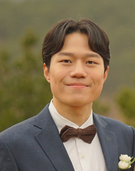

```{=html}
<style>
@import url('https://fonts.googleapis.com/css2?family=Black+Han+Sans&family=Jua&display=swap');

body{
  font-family: 'Jua', sans-serif;
  font-size: 16pt;
}
/* Headers */
h1,h2,h3,h4,h5,h6{
  font-size: 24pt;
}
</style>
```
```{r}
library(shiny)
library(flexdashboard)
library(ggplot2)
library(magrittr)
library(plotly)
library(dplyr)
library(palmerpenguins)
library(DT)
library(stringr)
```

```{r}
library(extrafont)
loadfonts()

gapminder_theme <- theme_classic(base_family = "NanumGothic") +
  theme(axis.text.y = element_blank()) +
  theme(axis.ticks.y = element_blank()) +
  theme(axis.line.y = element_blank()) +
  theme(legend.background = element_rect(fill = "gainsboro")) +
  theme(plot.background = element_rect(fill = "gainsboro")) +
  theme(panel.background = element_rect(fill = "gainsboro"))
```

# 데이터와 지지고 볶는 개발자 이현희 {data-icon="ion-android-clipboard"}

## Column {.sidebar data-width="300"}

<h3>

**이현희**

</h3>



### Contact

Email. [shavit0423\@naver.com](mailto:shavit0423@naver.com){.email} Phone 010 2698 0430

### Channel

Github. <https://github.com/shavit-es> 

Blog <https://shavites.tistory.com/>

## Column {.tabset .tabset-fade .tebset-dropdown data-width="600"}

### 경력사항

#### **뉴로클(Neurocle)**

직원유형: 인턴\
입사일: 2021-12-29\
퇴사일: 2022-02-25\
직급: 인턴\
담당업무: Application Engineer. 데이터 전처리, 딥러닝 모델 생성 및 개선, 자사 소프트웨어 QA, 결과보고서 작성

#### **한성마케팅**

직원유형: 계약직(아르바이트)\
입사일: 2017-01-02\
퇴사일: 2017-02-28\
직급: 사원\
담당업무: 블로그 마케팅 관리

### 학력 정보

| 학교명                           | 캠퍼스 | 주전공              | 부전공       | 평점/총점 | 입학연월 | 졸업연월 | 졸업상태 |
|-----------|---------|---------|---------|---------|---------|---------|---------|
| 한양대학교                       | 서울   | 공과대학 산업공학과 | 창업융합전공 | 3.89/4.5  | 2018.03  | 2023.02  | 재학중   |
| 건국대학교 사범대학 부속고등학교 | \-     | \-                  | \-           | \-        | 2014.03  | 2017.02  | 졸업     |
| 광남중학교                       | \-     | \-                  | \-           | \-        | 2011.03  | 2014.02  | 졸업     |

### 병역 정보

병역필(현역) (2020.07\~2022.01)

### 자격/수상

#### 정보기술자격(ITQ) 한글 A 등급

주관: 국가공인 한국생산성본부 취득년도: 2008년

#### 스쿠버다이버

주관: 사단법인 한국잠수협회 취득년도: 2009년

#### 한자 준4급

주관: 대한검정회 취득년도: 2015년

#### 워드프로세서 (단일등급)

주관: 대한상공회의소 취득년도: 2021년

#### 컴퓨터활용능력 2급

주관: 대한상공회의소 취득년도: 2021년

#### 정보기술자격(ITQ) 엑셀 A 등급

주관: 한국생산성본부 취득년도: 2021년

#### 정보기술자격(ITQ) 인터넷검색 A 등급

주관: 한국생산성본부 취득년도: 2021년

### 어학능력

#### TOEIC

TOEIC 890점 취득년도: 2021년

## 프로그래밍 능력 {data-width="150"}

### Python

```{r}
valueBox("Python", caption = paste("상", actionButton("button1", " ", style = "background-color:rgba(39, 128, 227, 0.0); border-color:rgba(39, 128, 227, 0.0); position: absolute; overflow: hidden; left: 0px; top: 0px; right: 0px; bottom: 0px; width:100%")), icon = "ion-social-python", color = "success")
```

### HTML5

```{r}
valueBox("HTML5", caption = paste("상", actionButton("button1", " ", style = "background-color:rgba(39, 128, 227, 0.0); border-color:rgba(39, 128, 227, 0.0); position: absolute; overflow: hidden; left: 0px; top: 0px; right: 0px; bottom: 0px; width:100%")), icon = "ion-social-html5", color = "success")
```

### CSS3

```{r}
valueBox("CSS3", caption = paste("중", actionButton("button1"," ", style = "background-color:rgba(39, 128, 227, 0.0); border-color:rgba(39, 128, 227, 0.0); position: absolute; overflow: hidden; left: 0px; top: 0px; right: 0px; bottom: 0px; width:100%")), icon = "ion-social-css3", color = "primary")
```

### R

```{r}
valueBox("R", caption = paste("중", actionButton("button1", " ", style = "background-color:rgba(39, 128, 227, 0.0); border-color:rgba(39, 128, 227, 0.0); position: absolute; overflow: hidden; left: 0px; top: 0px; right: 0px; bottom: 0px; width:100%")), icon = "ion-code", color = "primary")
```

### MySQL

```{r}
valueBox("MySQL", caption = paste("중", actionButton("button1", " ", style = "background-color:rgba(39, 128, 227, 0.0); border-color:rgba(39, 128, 227, 0.0); position: absolute; overflow: hidden; left: 0px; top: 0px; right: 0px; bottom: 0px; width:100%")), icon = "ion-code", color = "primary")
```

### PHP

```{r}
valueBox("PHP", caption = paste("중", actionButton("button1", " ", style = "background-color:rgba(39, 128, 227, 0.0); border-color:rgba(39, 128, 227, 0.0); position: absolute; overflow: hidden; left: 0px; top: 0px; right: 0px; bottom: 0px; width:100%")), icon = "ion-code", color = "primary")
```

### nodejs

```{r}
valueBox("Nodejs", caption = paste("중", actionButton("button1", " ", style = "background-color:rgba(39, 128, 227, 0.0); border-color:rgba(39, 128, 227, 0.0); position: absolute; overflow: hidden; left: 0px; top: 0px; right: 0px; bottom: 0px; width:100%")), icon = "ion-social-nodejs", color = "primary")
```

# 프로젝트(인공지능)

## Column {.sidebar data-width="300"}

<h3>

**이현희**

</h3>


### Contact

Email. [shavit0423\@naver.com](mailto:shavit0423@naver.com){.email} Phone 010 2698 0430

### Channel

Github. <https://github.com/shavit-es> 

Blog <https://shavites.tistory.com/>


## 인공지능(머신러닝, 딥러닝) {.tabset}

### 인공지능 기반 명품 브랜드테스트 사이트 제작

[](https://brandtest.site)

1인 프로젝트로 군생활 동안 혼자서 개인 프로젝트로서 만들었습니다. MZ세대에서 명품에 대한 관심이 날이 갈수록 늘어가고 있기 때문에, 자신이 입은 옷 스타일이 어떤 명품 스타일과 유사한지 알려주는 사이트를 만든다면 재미있을 것 같아 진행하게 되었습니다.

구글 Teachable Machine API를 연동하여 html을 기반으로 한 웹페이지를 개발하였습니다. 각 명품 브랜드 별 컬렉션(패션쇼) 사진을 파이썬 Selenium 크롤링을 활용해 4천장 이상 이미지를 수집해 전처리를 거쳐 3천장 이상의 이미지를 학습시켰습니다. 그리고 html, css, javascript를 활용해서 사용자가 사진을 업로드하면, 학습된 모델을 기반으로 어떤 명품 브랜드의 스타일과 가장 유사한지 분석을 해주고, 그 브랜드의 역사에 대해 간단히 소개하고 관련 상품을 추천해주는 것까지 하는 서비스를 구현하였습니다. 수익구조는 카카오 애드핏과 쿠팡 파트너스 사이트에 연동하여 광고를 활용하였습니다.

링크: <https://brandtest.site> (반응형 웹이지만 모바일에 최적화 되어있습니다.)\
코드: <https://github.com/shavit-es/brandtest>

### 스위스 잠재 파트너사 골드바 유형 Classification, OCR 모델

잠재 파트너사에서 뉴로클 사의 딥러닝 소프트웨어 성능을 확인하기 위해서 골드바 분류 태스크를 회사에 맡겼고, 이를 도와 진행했습니다. 골드바 분류는 골드바 사진이 주어졌을 때 logo, weight, pureness, material, serial number를 딥러닝을 활용해 각각 구하는 프로젝트였습니다. 골드바 사진은 2k정도 되는 고해상도로 약 1000장 가량 있었습니다. Feature들은 어느 제조사의 골드바인지 분류할 수 있는 logo, 골드바의 무게가 몇 g짜리인지를 알 수 있는 weight, 골드바의 순도가 몇%인지를 분류하는 pureness, 금인지 은인지 플래티넘인지 구분하는 material, 그리고 시리얼 넘버 값을 숫자로 구해내는 총 5개로 구성되어 있었습니다. 이를 구하기 위해서 맨 처음에 제가 인턴으로 들어오기 이전에는 골드바 이미지가 들어왔을 때 logo, weight, pureness, material 4개에 대해서 Object Detection 모델을 통해서 먼저 분류를 하고, 그 이후에 같은 이미지 사진을 활용해서 OCR 모델을 활용, 시리얼 넘버를 구하는 과정을 통해서 task를 진행하고 있었습니다. 하지만 OCR이 다른 pureness나 weight 등에 대해서도 작용하기도 하고, 기본적으로 가장 높은 정확도가 60%대로 매우 낮아 어려움을 겪고 있었습니다. 그 과정 속에서 제가 인턴으로 입사하였고 먼저 Object Detection 모델을 활용한 뒤에 OCR 모델을 앙상블하는 방법을 제안하였습니다. 그렇게 하기 위해 기존에 logo, weight, pureness, material의 4개에 대해서만 object detection 모델을 진행하던 것에서 더해 딥러닝 모델을 통해 serial number까지 5개의 features를 먼저 구분할 수 있도록 하였습니다. 이에 대한 object detection 모델 정확도가 99%이상 나왔고, 이후에 serial number 결과값으로 저장된 json 파일을 python의 open-cv 라이브러리를 활용해 Serial number 부분만을 crop하고 나머지 부분은 검게 처리하는 이미지 전처리 과정을 거쳤습니다. 이렇게 얻은 Object Detection이 Serial number부분이라고 검출한 부분만 존재하는 이미지로 OCR 모델을 학습시켜 진행하였고 OCR 정확도가 60%대에서 96%대로 크게 상승하였습니다.

### 국내 파트너사 Tag 검출 Object Detection 모델 고도화 지원

국내 파트너사에서 하얀 원형의 판에서 수직으로 꼽혀 있는 녹색 tag를 검출하는 Object Detection 모델에 대한 고도화를 의뢰하였습니다. 파트너사에서는 이렇게 녹색 tag를 검출함을 통해서 위치와 개수를 확인하기 위해 딥러닝 모델을 활용하고 있었습니다. 하지만 Object 모델 특성상 사각형으로 대상을 검출하기 때문에 녹색 tag가 매우 인접하여 대각선으로 위치하고 있는 경우에는 2개를 1개로 검출하여 카운팅하는 문제가 발생하고 있었습니다. 그렇다고 Segmentation 모델을 활용하기에는 이미지 특성 상 하나의 region으로 잡지 않는 경우가 많아 개수를 카운팅 할 때 정확도가 매우 떨어져 어쩔 수 없이 object detection 모델을 활용해야하는 상황이었습니다. 이에 모델을 학습할 때 최대한 tag와 인접하게 작게 레이블링을 다시 진행하였고, 같은 test set에 대해서 이전 모델에서 807장 중 43장에서 오검이 발생했었지만 개선된 모델에서는 6장의 오류가 발생하여 에러율이 약 5.3%에서 0.7%로 감소하여 큰 성능 개선이 있었습니다. 하지만 6장에 대해서 같은 오류가 발생하여 이러한 문제를 완전히 해결하는 것은 불가능 했고, Object Detection 모델에서 대각선으로 매우 인접하게 두 개 이상의 대상이 위치할 경우에 하나로 인식하는 문제는 추후의 연구과제로 남았습니다. 이를 해결하기 위한 방법으로 제시했던 것들 중 하나는 예측을 하는 과정에서 예측하기 전에 30도씩 회전하여 이미지를 증강한 뒤에 object detection 모델에서 모두 예측하고, 하나의 이미지로부터 증강된 이미지들 중 검출 개수가 가장 많이 나온 것을 선택하는 방법이 있었습니다. 프로젝트는 이미지 전처리, 모델 생성, 평가까지 모두 혼자 진행하여 보고하고 피드백을 받아 다시 개선하는 형식으로 진행하였습니다.

### 의료 데모 모델 학습-내시경(대장염) Classification 모델

사내에서 마케팅 및 고객 대응 자료로 활용하고자 의료 데모 모델을 만들었습니다. 이에 kaggle에서 내시경 이미지 데이터를 구하여 내시경 사진을 통해 대장염 여부를 판단하는 Classification 모델을 만드는 task를 진행하였습니다. 이에 296개의 test set에 대해서 7개의 오검이 나와 97.63%의 정확도를 가진 모델 생성에 성공하였습니다. 모델을 만드는 과정에서, 오히려 처음에는 단 2개의 오검만이 나와 99.32%의 정확도를 보였습니다. 하지만 내시경 사진이다보니 주변부에 환자와 관련된 정보들이 글자로 나와있었고, Classification 모델의 grad cam을 통해서 확인을 해보았을 때 일부 사진들이 이러한 정보를 토대로 판단을 하는 경우가 있었습니다. 이에 이는 모델을 실제 활용하는 데 있어 문제가 있을 것이라 판단하여 주변부의 글자들을 모두 Masking한 채로 다시 학습을 진행하였고, 위와 같은 결과가 나왔습니다. 프로젝트는 이미지 전처리, 모델 생성, 평가까지 모두 혼자 진행하여 보고하고 피드백을 받아 다시 개선하는 형식으로 진행하였습니다.

### 의료 데모 모델 학습-내시경(역류성 식도염) Classification 모델

사내에서 마케팅 및 고객 대응 자료로 활용하고자 의료 데모 모델을 만들었습니다. 이에 kaggle에서 내시경 이미지 데이터를 구하여 내시경 사진을 통해 역류성 식도염 여부를 판단하는 Classification 모델을 만드는 task를 진행하였습니다. 데이터셋은 정상 1000장, 역류성 식도염 사진 1000장으로 구성되어 있었으며, Train set과 test set 비율은 9:1로 하였습니다. 육안으로는 어떤 부위가 문제인지, 판단의 근거가 무엇인지 의학적 지식이 없는 상태에서 전혀 판단이 안 될 정도로 어려운 task였고, 모델의 정확도도 88%정도로 나왔습니다. 프로젝트는 이미지 전처리, 모델 생성, 평가까지 모두 혼자 진행하여 보고하고 피드백을 받아 다시 개선하는 형식으로 진행하였습니다.

### 전시회향 데모 모델 학습-윷놀이 Classification, Object Detection 모델

사내에서 전시회에서 프로그램 홍보용 자료로 전시회에서 활용하고자 현장에서 흥미를 느끼며 직접 바로 결과를 확인할 수 있는 윷놀이 Classification 모델과 Object Detection 모델을 만들었습니다. Classification 모델은 카메라를 통해서 실시간으로 윷놀이 결과를 받아들이며 이것이 도, 개, 걸, 윷, 모 중 어떤 결과인지 분류하는 모델이며, Object Detection 모델은 카메라를 통해서 실시간으로 각 윷의 위치와 앞면/뒷면 여부를 검출해내는 모델이었습니다. 두 모델 다 정확도가 test set에 대해서 100%로 완벽한 결과를 보였습니다. 데이터는 PC에 스탠드 카메라를 연결하여 직접 윷을 배치하며 사진을 찍어 2천장 이상 취득하였습니다. 특히, 손, 핸드폰, 등 노이즈로 작용할 수 있는 부분들을 background class로 처리하기 위해서 데이터를 취득할 때 손, 핸드폰 등이 이미지에 포함된 것들 또한 활용하여 학습을 진행하였습니다.다양한 전시회 환경에서 좋은 성능을 낼 수 있도록 다양한 빛 조건에서, 그리고 동일한 패드 위에서 동일한 스탠드 카메라로 사진을 찍어 데이터를 취득하였습니다. 프로젝트는 이미지 전처리, 모델 생성, 평가까지 모두 혼자 진행하여 보고하고 피드백을 받아 다시 개선하는 형식으로 진행하였습니다.

### 의료 데모 모델 학습-CT(손 골절부위 검출) - Object Detection 모델

사내에서 마케팅 및 고객 대응 자료로 활용하고자 의료 데모 모델을 만들었습니다. 이에 마찬가지로 kaggle에서 손 골절 CT 이미지 데이터를 구하여 손 골절 부위를 검출하는 object detection task를 진행하였습니다. 프로젝트는 이미지 전처리, 모델 생성, 평가까지 모두 혼자 진행하여 보고하고 피드백을 받아 다시 개선하는 형식으로 진행하였습니다.

### 사내 Auto Deep Learning 프로그램 성능 검사용 잎 병충해 검출 - Segementation 모델

사내의 Auto Deep Learning 프로그램인 Neuro-T 및 Neuro-X의 성능을 검증하고자 잎에 병이 있는 부분을 검출하는 Segmentation Task를 진행하였습니다. 딥러닝에서 Segmentation 모델의 경우 아직 부족한 부분이 많기 때문에 그러한 부분을 확인하고자 이러한 task를 진행하였으며, kaggle에서 레이블링 정보가 포함된 이미지를 활용하여 실험을 진행했습니다. 그 결과 약 80%대의 성능이 나왔고, Segmentation 정확도가 실제 결과 이미지 리뷰를 해 보았을 때 인간이 생각했을 때 느끼는 수치보다는 낮은 결과를 보이는 것으로 확인되었습니다. 프로젝트는 이미지 전처리, 모델 생성, 평가까지 모두 혼자 진행하여 보고하고 피드백을 받아 다시 개선하는 형식으로 진행하였습니다.

### 서울 소재 대학병원 논문 작성용 내시경 장기 분류 모델 학습 - Classification 모델

서울에 소재한 대학병원에서 병원에서의 딥러닝 활용을 위한 논문 작성을 위해 뉴로클 사에 문의를 하셨습니다. 내시경이 몸을 타고 들어갈 때 화면에 나오는 실시간 영상을 식도, 위, 소장, 대장에서 어떤 부분인지 분류하는 딥러닝 모델을 만드는 task를 진행하였습니다. Task를 진행할 때, 깨끗하게 장기가 잘 보이는 사진들은 모두 100%의 분류 정확도를 보였으나, 몸을 지나면서 많은 이물들에 화면이 가려지거나 할 때 매우 낮은 정확도를 보였습니다. 병원 측으로부터 실제 내시경 동영상을 받아 이를 파이썬 opencv를 활용해 프레임 단위로 이미지를 추출하여 각 장기당 10,000장 이상의 이미지를 활용하여 총 77,088장의 이미지를 사용하였으며, 처음에는 각 장기별 모든 이미지를 활용하여 모델을 학습하고 평가를 진행하며 지속적으로 모델을 개선하여 생성하였습니다. 그러나 소장 부분에서 이물이 많아 정확도가 80%대로 낮게 나왔고, 나머지 식도, 위, 대장에 대해서는 정확도가 95%이상 나왔습니다. 하지만 병원 측에서는 모든 장기에 대해서 95% 이상의 성능을 원하였기 때문에, 2개의 Classification 모델에 대해 앙상블 모델을 활용하기로 결정했습니다. 이는 먼저, 이물로 화면이 가득차 정확한 판단이 어려울 것으로 예상되는 레이블과 이외의 정상적인 사진들에 대해서 1차적으로 분류를 하고, 정상적으로 분류된 사진들에 대해서 다시 장기 분류를 진행했습니다. 이렇게 앙상블 모델을 적용하여 모델을 생성한 결과, 1차 모델에서는 77,088장의 모델 중 5,509장의 사진을 이물로 분류하였습니다. 그리고 일반 장기 이미지로 분류한 71,579장에 대하여 장기 분류를 진행한 결과, 기존에 80%대로 정확도가 낮았던 소장은 95%, 나머지 장기들은 90% 후반대로 정확도가 크게 상승하였습니다. 프로젝트는 이미지 전처리, 모델 생성, 평가까지 모두 혼자 진행하여 보고하고 피드백을 받아 다시 개선하는 형식으로 진행하였습니다.

## 프로그래밍 능력 {data-width="150"}

### Python

```{r}
valueBox("Python", caption = paste("상", actionButton("button1", " ", style = "background-color:rgba(39, 128, 227, 0.0); border-color:rgba(39, 128, 227, 0.0); position: absolute; overflow: hidden; left: 0px; top: 0px; right: 0px; bottom: 0px; width:100%")), icon = "ion-social-python", color = "success")
```

### HTML5

```{r}
valueBox("HTML5", caption = paste("상", actionButton("button1", " ", style = "background-color:rgba(39, 128, 227, 0.0); border-color:rgba(39, 128, 227, 0.0); position: absolute; overflow: hidden; left: 0px; top: 0px; right: 0px; bottom: 0px; width:100%")), icon = "ion-social-html5", color = "success")
```

### CSS3

```{r}
valueBox("CSS3", caption = paste("중", actionButton("button1"," ", style = "background-color:rgba(39, 128, 227, 0.0); border-color:rgba(39, 128, 227, 0.0); position: absolute; overflow: hidden; left: 0px; top: 0px; right: 0px; bottom: 0px; width:100%")), icon = "ion-social-css3", color = "primary")
```

### R

```{r}
valueBox("R", caption = paste("중", actionButton("button1", " ", style = "background-color:rgba(39, 128, 227, 0.0); border-color:rgba(39, 128, 227, 0.0); position: absolute; overflow: hidden; left: 0px; top: 0px; right: 0px; bottom: 0px; width:100%")), icon = "ion-code", color = "primary")
```

### MySQL

```{r}
valueBox("MySQL", caption = paste("중", actionButton("button1", " ", style = "background-color:rgba(39, 128, 227, 0.0); border-color:rgba(39, 128, 227, 0.0); position: absolute; overflow: hidden; left: 0px; top: 0px; right: 0px; bottom: 0px; width:100%")), icon = "ion-code", color = "primary")
```

### PHP

```{r}
valueBox("PHP", caption = paste("중", actionButton("button1", " ", style = "background-color:rgba(39, 128, 227, 0.0); border-color:rgba(39, 128, 227, 0.0); position: absolute; overflow: hidden; left: 0px; top: 0px; right: 0px; bottom: 0px; width:100%")), icon = "ion-code", color = "primary")
```

### nodejs

```{r}
valueBox("Nodejs", caption = paste("중", actionButton("button1", " ", style = "background-color:rgba(39, 128, 227, 0.0); border-color:rgba(39, 128, 227, 0.0); position: absolute; overflow: hidden; left: 0px; top: 0px; right: 0px; bottom: 0px; width:100%")), icon = "ion-social-nodejs", color = "primary")
```

# 프로젝트(웹)

## Column {.sidebar data-width="300"}

<h3>

**이현희**

</h3>


### Contact

Email. [shavit0423\@naver.com](mailto:shavit0423@naver.com){.email} Phone 010 2698 0430

### Channel

Github. <https://github.com/shavit-es> 

Blog <https://shavites.tistory.com/>


## 웹(PHP, HTML5, CSS3, MySQL) {.tabset .tabset-dropdown}

### 인공지능 기반 명품 브랜드테스트 사이트 제작

[](https://brandtest.site)

1인 프로젝트로 군생활 동안 혼자서 개인 프로젝트로서 만들었습니다. MZ세대에서 명품에 대한 관심이 날이 갈수록 늘어가고 있기 때문에, 자신이 입은 옷 스타일이 어떤 명품 스타일과 유사한지 알려주는 사이트를 만든다면 재미있을 것 같아 진행하게 되었습니다.

구글 Teachable Machine API를 연동하여 html을 기반으로 한 웹페이지를 개발하였습니다. 각 명품 브랜드 별 컬렉션(패션쇼) 사진을 파이썬 Selenium 크롤링을 활용해 4천장 이상 이미지를 수집해 전처리를 거쳐 3천장 이상의 이미지를 학습시켰습니다. 그리고 html, css, javascript를 활용해서 사용자가 사진을 업로드하면, 학습된 모델을 기반으로 어떤 명품 브랜드의 스타일과 가장 유사한지 분석을 해주고, 그 브랜드의 역사에 대해 간단히 소개하고 관련 상품을 추천해주는 것까지 하는 서비스를 구현하였습니다. 수익구조는 카카오 애드핏과 쿠팡 파트너스 사이트에 연동하여 광고를 활용하였습니다.

### 강동경찰서 구내식당 식수 조사 홈페이지 제작

[](https://gangdongpolice-resta-qrkuf.run.goorm.io/)

1인 프로젝트로 군생활 동안 혼자서 개인 프로젝트로서 만들었습니다. 군생활을 강동경찰서에서 의무경찰 취사대원으로 복무하였기 때문에, 주로 강동경찰서 내에 있는 구내식당에서 근무를 하였습니다. 복무 기간 동안 구내 식당 운영을 지켜보았는데, 구내 식당을 운영하는 데 있어 일근, 당직, 비번이 번갈아가면서 있고 경찰서의 각 부서별로 선택적으로 구내식당에 식사를 하러 온다는 특성 때문에 식수 예측에 어려움을 겪고 있었습니다. 이에 매일매일 직원이 얼마나 올 지 몰라 많은 음식물 쓰레기가 발생하거나, 아니면 음식이 부족하여 늦게 온 직원 분들에게 음식을 제공하지 못하는 상황이 자주 일어났습니다. 이에 식당 반장님께 제가 한 번 식당 식수 조사를 미리 받을 수 있는 홈페이지를 제작하겠다고 말씀드렸고, 식당반장님께서는 그렇게 하면 정말 좋을 것 같다고 말씀하셔서 약 2달 간 홈페이지를 제작하였습니다.

홈페이지는 공지사항을 올리는 게시판, 1주 단위의 메뉴를 올리는 게시판, 그리고 식수 조사를 하는 페이지로 크게 3가지의 기능을 구현하였습니다. 공지사항을 올리는 게시판과 메뉴를 올리는 게시판 모두 관리자만 글을 게시할 수 있도록 php를 활용하여 sql 서버에 비밀번호를 저장하고 대조하게 하였습니다. 식수 조사를 하는 페이지는 금일/내일 데이터를 나누어 sql 서버에 저장하고, 매일 정각마다 내일이었던 데이터를 금일로 바꾸는 작업을 mysql문을 통해서 자동으로 업데이트 되도록 하였습니다. 사이트를 만드는 데 주된 언어는 PHP를 활용하였습니다.

링크 : <https://gangdongpolice-resta-qrkuf.run.goorm.io/> (반응형 웹이지만 모바일에 최적화 되어있습니다.)

코드: <https://github.com/shavit-es/gangdongpolice_restaurant>

## 프로그래밍 능력 {data-width="150"}

### Python

```{r}
valueBox("Python", caption = paste("상", actionButton("button1", " ", style = "background-color:rgba(39, 128, 227, 0.0); border-color:rgba(39, 128, 227, 0.0); position: absolute; overflow: hidden; left: 0px; top: 0px; right: 0px; bottom: 0px; width:100%")), icon = "ion-social-python", color = "success")
```

### HTML5

```{r}
valueBox("HTML5", caption = paste("상", actionButton("button1", " ", style = "background-color:rgba(39, 128, 227, 0.0); border-color:rgba(39, 128, 227, 0.0); position: absolute; overflow: hidden; left: 0px; top: 0px; right: 0px; bottom: 0px; width:100%")), icon = "ion-social-html5", color = "success")
```

### CSS3

```{r}
valueBox("CSS3", caption = paste("중", actionButton("button1"," ", style = "background-color:rgba(39, 128, 227, 0.0); border-color:rgba(39, 128, 227, 0.0); position: absolute; overflow: hidden; left: 0px; top: 0px; right: 0px; bottom: 0px; width:100%")), icon = "ion-social-css3", color = "primary")
```

### R

```{r}
valueBox("R", caption = paste("중", actionButton("button1", " ", style = "background-color:rgba(39, 128, 227, 0.0); border-color:rgba(39, 128, 227, 0.0); position: absolute; overflow: hidden; left: 0px; top: 0px; right: 0px; bottom: 0px; width:100%")), icon = "ion-code", color = "primary")
```

### MySQL

```{r}
valueBox("MySQL", caption = paste("중", actionButton("button1", " ", style = "background-color:rgba(39, 128, 227, 0.0); border-color:rgba(39, 128, 227, 0.0); position: absolute; overflow: hidden; left: 0px; top: 0px; right: 0px; bottom: 0px; width:100%")), icon = "ion-code", color = "primary")
```

### PHP

```{r}
valueBox("PHP", caption = paste("중", actionButton("button1", " ", style = "background-color:rgba(39, 128, 227, 0.0); border-color:rgba(39, 128, 227, 0.0); position: absolute; overflow: hidden; left: 0px; top: 0px; right: 0px; bottom: 0px; width:100%")), icon = "ion-code", color = "primary")
```

### nodejs

```{r}
valueBox("Nodejs", caption = paste("중", actionButton("button1", " ", style = "background-color:rgba(39, 128, 227, 0.0); border-color:rgba(39, 128, 227, 0.0); position: absolute; overflow: hidden; left: 0px; top: 0px; right: 0px; bottom: 0px; width:100%")), icon = "ion-social-nodejs", color = "primary")
```
